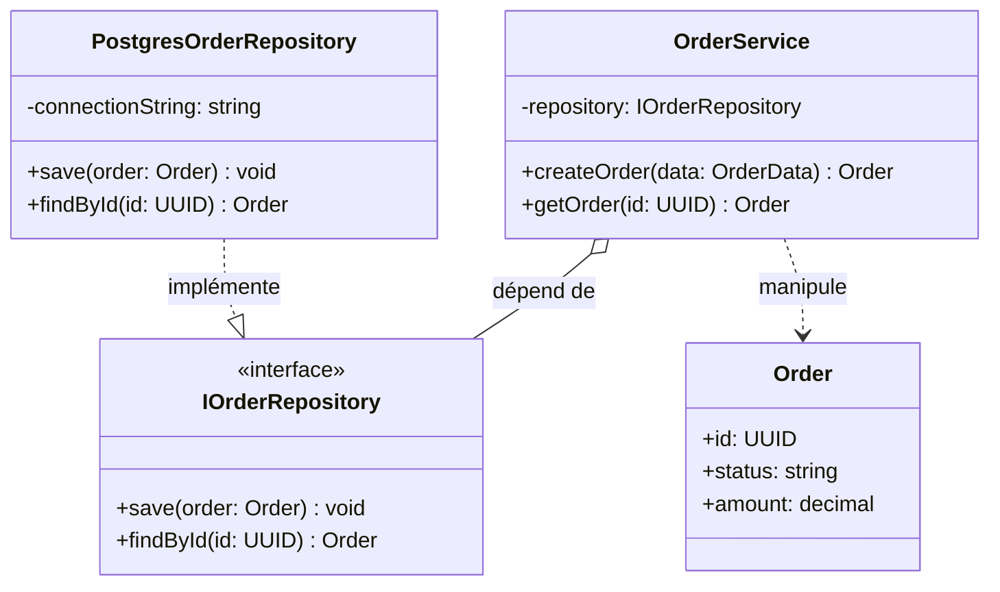

```mermaid
classDiagram
    class IOrderRepository {
        <<interface>>
        +save(order: Order) void
        +findById(id: UUID) Order
    }

    class PostgresOrderRepository {
        -connectionString: string
        +save(order: Order) void
        +findById(id: UUID) Order
    }

    class OrderService {
        -repository: IOrderRepository
        +createOrder(data: OrderData) Order
        +getOrder(id: UUID) Order
    }

    class Order {
        +id: UUID
        +status: string
        +amount: decimal
    }

    PostgresOrderRepository ..|> IOrderRepository : implémente
    OrderService o-- IOrderRepository : dépend de
    OrderService ..> Order : manipule
```