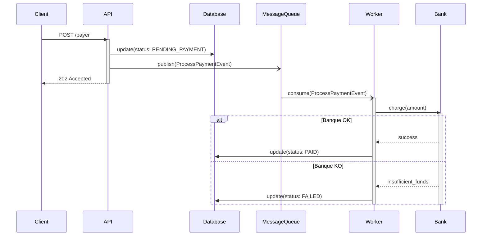

```mermaid
sequenceDiagram
    participant Client
    participant API
    participant Database
    participant MessageQueue
    participant Worker
    participant Bank

    Client->>API: POST /payer
    activate API
    API->>Database: update(status: PENDING_PAYMENT)
    API-)MessageQueue: publish(ProcessPaymentEvent)
    API-->>Client: 202 Accepted
    deactivate API

    MessageQueue-)Worker: consume(ProcessPaymentEvent)
    activate Worker
    Worker->>Bank: charge(amount)
    activate Bank

    alt Banque OK
        Bank-->>Worker: success
        Worker->>Database: update(status: PAID)
    else Banque KO
        Bank-->>Worker: insufficient_funds
        Worker->>Database: update(status: FAILED)
    end
    deactivate Bank
    deactivate Worker
```