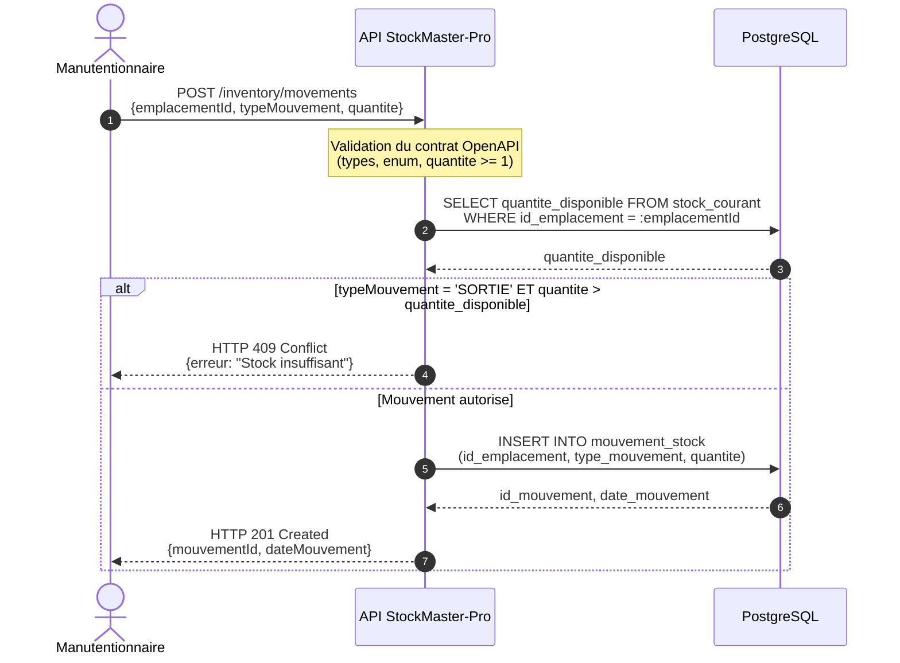

# StockMaster-Pro — Architecture comportementale

Module de gestion d'inventaire physique pour MegaShop-B2B.
Ce document décrit le comportement de l'API de déclaration des mouvements
de stock et garantit l'alignement entre les couches SQL, API et métier.

---

## 1. Glossaire et mapping des couches

| Concept métier | SQL (snake_case) | OpenAPI (camelCase) | Type |
|---|---|---|---|
| Emplacement | `id_emplacement` | `emplacementId` | `integer` |
| Sens du mouvement | `type_mouvement` | `typeMouvement` | `string` (enum `ENTREE`/`SORTIE`) |
| Quantité | `quantite` | `quantite` | `integer`, `minimum: 1` |
| Identifiant mouvement | `id_mouvement` | `mouvementId` | `integer` |
| Horodatage | `date_mouvement` | `dateMouvement` | `string`, `format: date-time` |
| Stock calculé | `stock_courant.quantite_disponible` | `quantiteDisponible` | `integer` |

Les identifiants sont des entiers (`GENERATED ALWAYS AS IDENTITY`), pas des UUID.
Le contrat OpenAPI reflète strictement ce choix : `type: integer`, sans `format: uuid`.

## 2. Diagramme de séquence : déclaration d'un mouvement

## 3. Décisions d'architecture

### 3.1 Distinction entre erreur de contrat (400) et conflit métier (409)

Deux natures d'erreur coexistent et ne doivent pas être confondues.

Le **400 Bad Request** sanctionne un payload qui ne respecte pas le contrat :
`quantite` à zéro ou négative, `typeMouvement` absent de l'énumération, champ
manquant. Cette validation s'effectue à l'entrée de l'API, avant tout accès à
la base de données. Aucune requête SQL n'est émise.

Le **409 Conflict** sanctionne une requête syntaxiquement valide mais
incompatible avec l'état réel du système. Demander une sortie de 100 unités
est une requête parfaitement formée ; elle devient impossible lorsque
l'emplacement n'en contient que 42. Le 409 est le code approprié car il
signale un conflit avec l'état de la ressource, non un défaut de forme.

Cette distinction est visible dans le diagramme : la note de validation
précède l'interrogation de la base, et la branche de rejet du fragment `alt`
n'émet aucun `INSERT`.

### 3.2 Source unique de vérité pour le stock

L'API interroge la vue `stock_courant` et ne réimplémente jamais le calcul
d'agrégation. La formule « somme des entrées moins somme des sorties » existe
à un seul endroit du système : la définition de la vue.

Si la couche applicative recalculait le stock de son côté, deux définitions
coexisteraient et pourraient diverger lors d'une évolution : par exemple
l'ajout d'un type de mouvement `INVENTAIRE`. Centraliser le calcul dans la vue
garantit que toute évolution se propage automatiquement à tous les consommateurs.

### 3.3 Portée de la garde de non-négativité

Conformément au cahier des charges (« L'API doit rejeter toute tentative de
sortir une quantité supérieure à ce qui est réellement présent ») la règle de
gouvernance est portée par la couche applicative. C'est elle qui produit le
message d'erreur métier exploitable par le manutentionnaire.

**Limitation connue.** Ce contrôle lit le stock puis écrit le mouvement en
deux opérations distinctes. En environnement fortement concurrent, deux
sorties simultanées sur un même emplacement peuvent toutes deux lire un stock
suffisant avant qu'aucune n'ait été enregistrée, et produire un stock négatif.
Cette situation ne relève pas d'un défaut d'implémentation mais de la
non-atomicité de la séquence lecture-écriture.

La levée de cette limitation relève d'un mécanisme de verrouillage au niveau
de la base (verrou explicite sur la ligne `emplacement`, ou niveau d'isolation
`SERIALIZABLE`). Elle est documentée ici comme dette technique identifiée,
à traiter avant toute mise en production multi-postes.

### 3.4 Immuabilité du journal des mouvements

La table `mouvement_stock` est un journal en écriture seule. Aucune opération
`UPDATE` ni `DELETE` n'est prévue par l'architecture. Une erreur de saisie se
corrige par l'ajout d'un mouvement de sens inverse, qui laisse une trace
auditable de la correction elle-même.

Les contraintes `ON DELETE RESTRICT` sur les clés étrangères matérialisent
cette exigence : la base refuse physiquement la suppression d'un emplacement
ou d'un produit portant un historique.